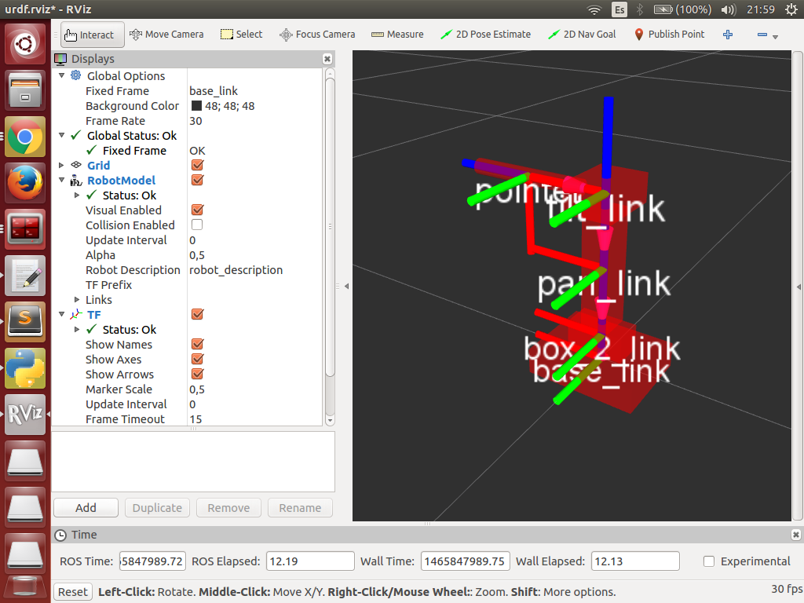

# robot001 ROS stuff!



    roslaunch robot001_description display.launch


    rosrun actionlib axclient.py /robot_controller

````
trajectory: 
  header: 
    seq: 0
    stamp: 
      secs: 0
      nsecs: 0
    frame_id: ''
  joint_names: ['pan_joint', 'tilt_joint']
  points:
  - positions: [10, 0]
    velocities: [0]
    accelerations: [0]
    effort: [0]
    time_from_start: {secs: 0, nsecs: 0}
````